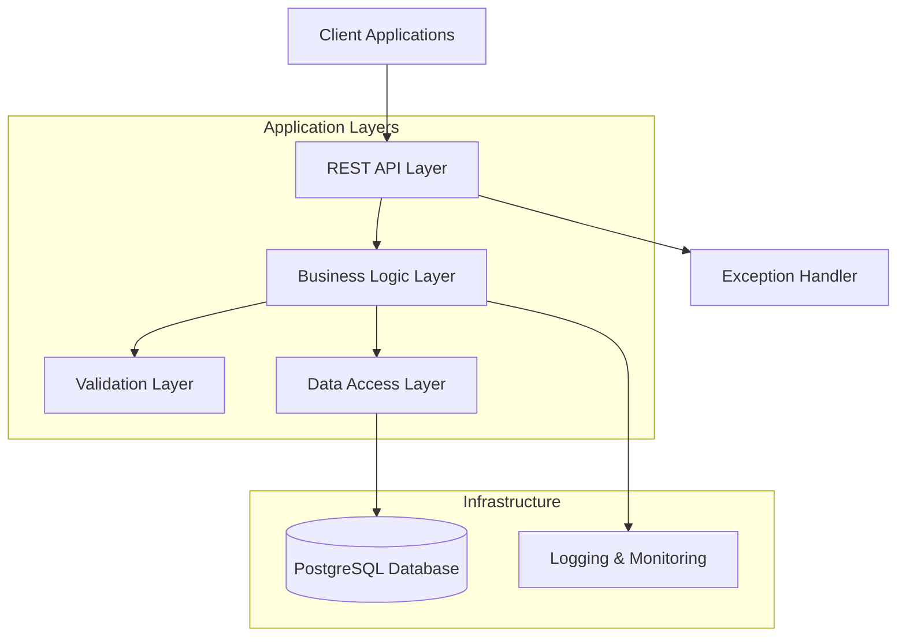

# 🏦 FX Deals Data Warehouse

A **robust** and **scalable** FX deals data warehouse system built for **Bloomberg-style** financial data ingestion and validation. This system provides secure persistence of foreign exchange transactions with comprehensive validation, duplicate detection, and batch processing capabilities.


## 📋 Table of Contents

- [🎯 Project Overview](#-project-overview)
- [🏗️ System Architecture](#-system-architecture)
- [✨ Key Features](#-key-features)
- [🛠️ Technology Stack](#-technology-stack)
- [🚀 Quick Start](#-quick-start)
- [📡 API Documentation](#-api-documentation)
- [🧪 Testing](#-testing)
- [📊 Monitoring](#-monitoring)
- [📁 Project Structure](#-project-structure)

## 🎯 Project Overview

The **FX Deals Data Warehouse** is designed to handle foreign exchange deal processing with the following core requirements:

- **Deal Validation**: Comprehensive validation of deal structure and data integrity
- **Duplicate Prevention**: Ensures no duplicate deals are imported based on unique deal IDs
- **No Rollback Policy**: Valid deals are persisted even when some records in a batch fail
- **Batch Processing**: Support for processing multiple deals simultaneously
- **Audit Trail**: Complete logging and monitoring of all operations

## 🏗️ System Architecture



## ✨ Key Features

### 🔐 Data Validation

- **ISO 4217 Currency Code Verification**
- **Unique Deal ID Enforcement**
- **Timestamp & Amount Validation**
- **Field Presence Validation**

### 🚀 Processing Capabilities

- **Single Deal Processing**
- **Batch Deal Processing**
- **No Rollback Strategy**
- **Partial Success Handling**

### 📊 Monitoring & Observability

- **Comprehensive Logging**
- **Swagger API Documentation**
- **Health Check Endpoints**
- **Database Administration UI**

### 🛡️ Error Handling

- **Global Exception Handling**
- **Detailed Error Messages**
- **Graceful Failure Management**

## 🛠️ Technology Stack

### Backend

- **Java 17** - Programming Language
- **Spring Boot 3.5.0** - Application Framework
- **Spring Data JPA** - Data Access Layer
- **Spring Validation** - Input Validation
- **Hibernate** - ORM Framework

### Database

- **PostgreSQL 16** - Primary Database
- **H2** - In-Memory Database (Testing)

### Documentation & Testing

- **Swagger/OpenAPI 3** - API Documentation
- **JUnit 5** - Unit Testing
- **Mockito** - Mocking Framework
- **Jacoco** - Code Coverage

### DevOps & Deployment

- **Docker** - Containerization
- **Docker Compose** - Multi-container Deployment
- **Maven** - Build Tool
- **Makefile** - Task Automation

## 🚀 Quick Start

### Prerequisites

- Java 17 or higher
- Docker & Docker Compose
- Maven 3.8+

### Installation

1. **Clone the Repository**

   ```bash
   git clone https://github.com/your-username/clustereddatawarehouse.git
   cd clustereddatawarehouse
   ```

2. **Start the Application**

   ```bash
   make run
   ```

3. **Access the Services**
   - **API Base URL**: http://localhost:8082
   - **Swagger UI**: http://localhost:8082/swagger-ui.html
   - **Database Admin**: http://localhost:5050
     - Email: `admin@warehouse.com`
     - Password: `admin123`

### Available Commands

```bash
make help          # Show all available commands
make run           # Start all services
make run-detached  # Start services in background
make down          # Stop and remove containers
make test          # Run tests
make test-coverage # Run tests with coverage
make logs          # View application logs
```

## 📡 API Documentation

### Deal Processing Endpoints

#### Create Single Deal

```http
POST /api/deals
Content-Type: application/json

{
  "id": "FX001",
  "fromCurrency": "USD",
  "toCurrency": "EUR",
  "timestamp": "2024-01-15T10:30:00",
  "amount": 1000000.00
}
```

#### Batch Process Deals

```http
POST /api/deals/batch
Content-Type: application/json

[
  {
    "id": "FX001",
    "fromCurrency": "USD",
    "toCurrency": "EUR",
    "timestamp": "2024-01-15T10:30:00",
    "amount": 1000000.00
  },
  {
    "id": "FX002",
    "fromCurrency": "GBP",
    "toCurrency": "USD",
    "timestamp": "2024-01-15T11:45:00",
    "amount": 750000.00
  }
]
```

#### Get All Deals

```http
GET /api/deals
```

### Response Formats

#### Successful Single Deal Response

```json
{
  "id": "FX001",
  "fromCurrency": "USD",
  "toCurrency": "EUR",
  "timestamp": "2024-01-15T10:30:00",
  "amount": 1000000.0
}
```

#### Batch Processing Response

```json
{
  "totalRequests": 5,
  "successfulDeals": 4,
  "failedDeals": 1,
  "successfulResults": [...],
  "errorMessages": [
    "Failed to process deal FX006: Request is already imported."
  ]
}
```

### Error Responses

#### Validation Error

```json
{
  "fromCurrency": "Currency code must be a 3-letter ISO code",
  "amount": "Amount must be greater than zero"
}
```

#### Duplicate Deal Error

```json
{
  "error": "Request is already imported."
}
```

## 🧪 Testing

### Run Tests

```bash
# Run all tests
make test

# Run tests with coverage report
make test-coverage
```

### Test Coverage

The project maintains **80%+ test coverage** with comprehensive testing of:

- ✅ Business Logic Validation
- ✅ API Endpoints
- ✅ Error Handling
- ✅ Data Persistence

### Sample Test Data

Use the provided sample data file for testing:

```bash
curl -X POST http://localhost:8082/api/deals/batch \
  -H "Content-Type: application/json" \
  -d @sample-data/sample-deals.json
```

## 📊 Monitoring

### Health Checks

- **Application Health**: `/actuator/health`
- **Application Info**: `/actuator/info`

### Logging

The application provides structured logging with different levels:

- **INFO**: General application flow
- **WARN**: Validation failures and duplicates
- **ERROR**: System errors and exceptions
- **DEBUG**: Detailed execution traces

### Database Monitoring

Access pgAdmin at http://localhost:5050 to monitor database performance and data.

## 📁 Project Structure

```
clustereddatawarehouse/
├── src/
│   ├── main/
│   │   ├── java/com/progressoft/clustereddatawarehouse/
│   │   │   ├── controller/          # REST Controllers
│   │   │   ├── service/             # Business Logic
│   │   │   ├── model/               # DTOs and Entities
│   │   │   ├── repository/          # Data Access Layer
│   │   │   ├── exception/           # Custom Exceptions
│   │   │   ├── config/              # Configuration Classes
│   │   │   └── aspect/              # Cross-cutting Concerns
│   │   └── resources/
│   │       └── application.yml      # Application Configuration
│   └── test/                        # Test Classes
├── sample-data/                     # Sample JSON Data
├── docker-compose.yml               # Docker Services
├── Dockerfile                       # Application Container
├── Makefile                         # Build Automation
├── pom.xml                          # Maven Configuration
└── README.md                        # This File
```

## 🔧 Configuration

### Database Configuration

```yaml
spring:
  datasource:
    url: jdbc:postgresql://postgres-db:5432/warehouse
    username: postgres
    password: postgres
  jpa:
    hibernate:
      ddl-auto: create
```

### Validation Rules

- **Deal ID**: Required, must be unique
- **Currency Codes**: Must be valid ISO 4217 codes (3 letters)
- **Amount**: Must be positive number
- **Timestamp**: Must be valid ISO 8601 format

## 🤝 Contributing

1. Fork the repository
2. Create your feature branch (`git checkout -b feature/amazing-feature`)
3. Commit your changes (`git commit -m 'Add amazing feature'`)
4. Push to the branch (`git push origin feature/amazing-feature`)
5. Open a Pull Request

## 📝 License

This project is licensed under the MIT License - see the LICENSE file for details.

## 🙏 Acknowledgments

- **ProgressSoft Corporation** - For the assignment opportunity
- **Spring Boot Team** - For the excellent framework
- **PostgreSQL Community** - For the robust database system

---

**Built with ❤️ for ProgressSoft Corporation Assignment**
