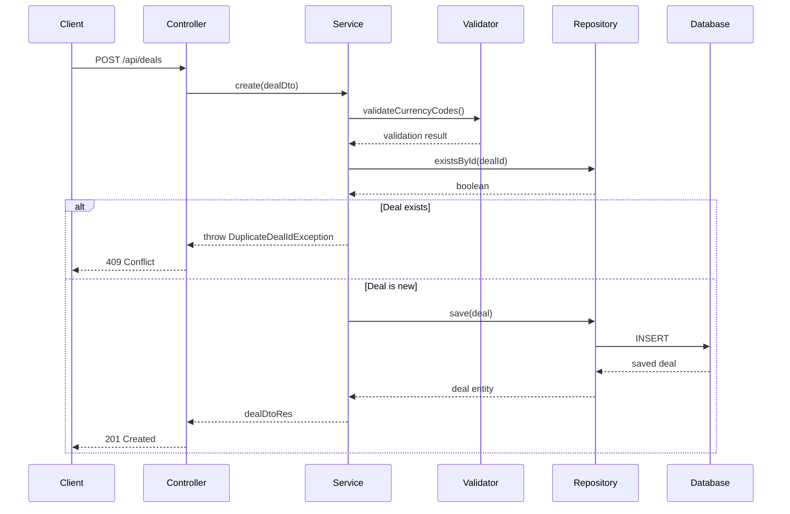
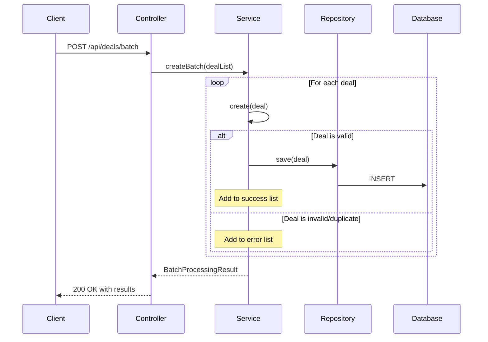

# 📋 Technical Documentation

## API Flow Diagrams

### Single Deal Processing Flow



### Batch Processing Flow



## Implementation Details

### Validation Strategy

- **Currency Validation**: Uses Java's built-in `Currency.getInstance()` method
- **Duplicate Check**: Database-level unique constraint + application-level check
- **Field Validation**: Jakarta Validation annotations with custom messages

### No Rollback Implementation

The batch processing implements a "no rollback" strategy by:

1. Processing each deal individually in a loop
2. Catching exceptions per deal (not per batch)
3. Continuing processing even when individual deals fail
4. Collecting both successful results and error messages
5. Returning comprehensive results to the client

### Error Handling Strategy

- **Global Exception Handler**: Centralized error handling using `@RestControllerAdvice`
- **Custom Exceptions**: Domain-specific exceptions for better error categorization
- **Structured Responses**: Consistent error response format across all endpoints

### Logging & Monitoring

- **AOP Aspects**: Method-level logging for service layer operations
- **Structured Logging**: JSON-formatted logs for better parsing
- **Performance Tracking**: Entry/exit logging with execution time tracking

## Database Schema

```sql
CREATE TABLE deals (
    id VARCHAR(255) PRIMARY KEY,
    from_currency VARCHAR(3) NOT NULL,
    to_currency VARCHAR(3) NOT NULL,
    timestamp TIMESTAMP NOT NULL,
    amount DECIMAL(19,2) NOT NULL,
    CONSTRAINT positive_amount CHECK (amount > 0)
);

CREATE INDEX idx_deals_timestamp ON deals(timestamp);
CREATE INDEX idx_deals_currency_pair ON deals(from_currency, to_currency);
```

## Performance Considerations

### Database Optimizations

- **Primary Key**: String-based deal ID for natural key lookup
- **Indexes**: Timestamp and currency pair indexes for common queries
- **Connection Pooling**: Spring Boot default HikariCP configuration

### Application Optimizations

- **Batch Processing**: Processes deals in memory without database transactions
- **Validation Caching**: Currency validation uses singleton Currency instances
- **Lazy Loading**: JPA lazy loading for related entities (if any)

## Security Considerations

### Input Validation

- **SQL Injection Prevention**: JPA/Hibernate parameterized queries
- **Input Sanitization**: Jakarta Validation with regex patterns
- **Size Limits**: JSON payload size limits in Spring Boot

### Data Integrity

- **Unique Constraints**: Database-level uniqueness enforcement
- **Referential Integrity**: Foreign key constraints (if applicable)
- **Transaction Management**: Spring's declarative transaction management

## Testing Strategy

### Unit Testing

- **Service Layer**: Business logic testing with mocked dependencies
- **Repository Layer**: Data access testing with @DataJpaTest
- **Controller Layer**: HTTP endpoint testing with @WebMvcTest

### Integration Testing

- **End-to-End**: Full application testing with TestContainers
- **Database Integration**: Real database testing with test data
- **Error Scenarios**: Exception handling and error response testing

## Deployment Architecture

### Container Strategy

- **Multi-stage Build**: Optimized Docker image with build-time and runtime stages
- **Health Checks**: Container health monitoring
- **Resource Limits**: Memory and CPU constraints for production

### Environment Configuration

- **Profile-based Config**: Development, testing, and production profiles
- **Externalized Config**: Environment variables for sensitive data
- **Configuration Validation**: Startup-time configuration validation
